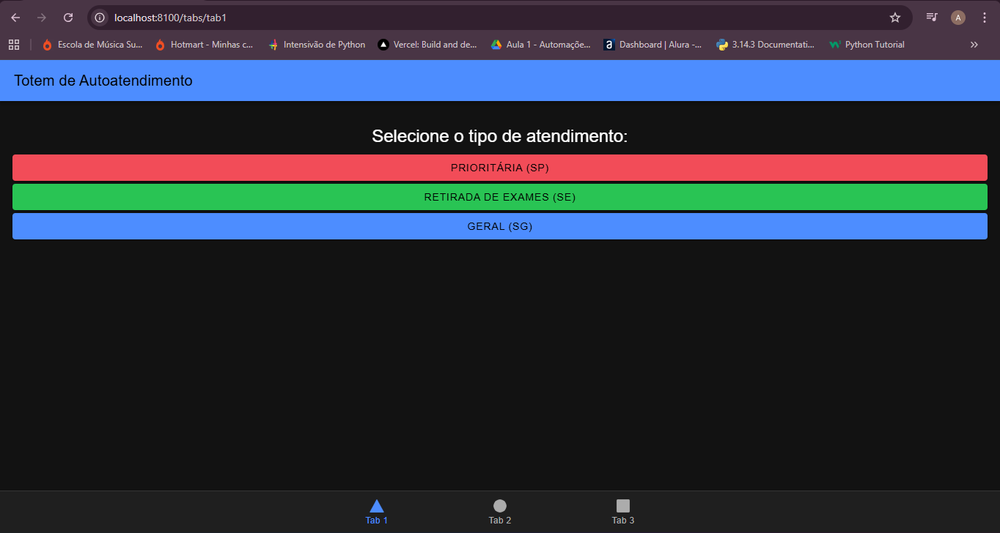
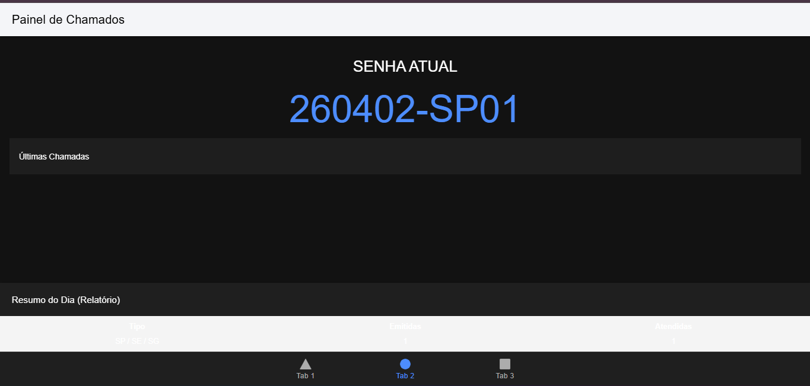

# MobileTicketsIonic 🏥

<<<<<<< HEAD
Sistema de Controle de Atendimento em Filas de Laboratórios Médicos — desenvolvido com **Ionic Framework + Angular + Capacitor**.

---

## 📋 Sobre o Projeto

O **MobileTicketsIonic** é um aplicativo mobile para gerenciamento de filas de atendimento em laboratórios médicos. O sistema simula o fluxo completo de atendimento com emissão de senhas, painel de chamadas, gerenciamento pelo atendente e relatórios detalhados.

### Agentes do Sistema

| Agente | Sigla | Papel |
|--------|-------|-------|
| Agente Sistema | AS | Emite as senhas e responde aos comandos da atendente |
| Agente Atendente | AA | Chama o próximo na fila e efetua o atendimento no guichê |
| Agente Cliente | AC | Emite sua senha no totem e aguarda ser chamado no painel |

---

## 🎫 Tipos de Senha

| Código | Nome | Prioridade | TM Base | Variação |
|--------|------|-----------|---------|---------|
| **SP** | Senha Prioritária | Alta | 15 min | ± 5 min aleatório |
| **SE** | Senha para Exames | Média | < 1 min | 1 min (95%) / 5 min (5%) |
| **SG** | Senha Geral | Baixa | 5 min | ± 3 min aleatório |

### Ordem de Atendimento

```
[SP] → [SE | SG] → [SP] → [SE | SG] → ...
```

Sempre uma SP (se houver), seguida de uma SE ou SG, repetindo até o fim do expediente.

---

## 📱 Telas do Projeto

### Tela 1 — Totem de Senhas (Agente Cliente)

> O cliente acessa o totem e seleciona o tipo de atendimento desejado.

```
┌─────────────────────────────────┐
│  🏥  Totem de Senhas            │
├─────────────────────────────────┤
│  ✅ Atendimento em funcionamento │
│     (07h - 17h)                  │
│                                  │
│      🏥 Laboratório Médico       │
│   Selecione o tipo de atendimento│
│                                  │
│  ┌──────────────────────────┐   │
│  │ ⭐ Prioritário      [SP] │   │
│  │ Idosos, gestantes, PCD   │   │
│  └──────────────────────────┘   │
│                                  │
│  ┌──────────────────────────┐   │
│  │ 👥 Atendimento Geral [SG]│   │
│  │ Consultas e atendimentos  │   │
│  └──────────────────────────┘   │
│                                  │
│  ┌──────────────────────────┐   │
│  │ 📄 Retirada Exames   [SE]│   │
│  │ Buscar resultados         │   │
│  └──────────────────────────┘   │
└─────────────────────────────────┘
```

Após a seleção, o modal exibe a senha emitida no formato `YYMMDD-PPSQ`:

```
┌─────────────────────────────────┐
│  Sua Senha              [✕]     │
├─────────────────────────────────┤
│                                  │
│     260605-SP01                  │
│                                  │
│     [ Prioritário ]              │
│                                  │
│  Aguarde ser chamado no painel  │
│  Emitida às 08:35:12             │
│                                  │
│     [      Fechar      ]         │
└─────────────────────────────────┘
```

---

### Tela 2 — Painel de Chamadas (Agente Sistema / Público)

> Exibe as 5 últimas senhas chamadas e o status dos guichês em tempo real.

```
┌─────────────────────────────────┐
│  📺  Painel de Chamadas  08:42  │
├─────────────────────────────────┤
│  🏢 Status dos Guichês          │
│  ┌────────┐┌────────┐┌────────┐ │
│  │Guichê 1││Guichê 2││Guichê 3│ │
│  │  ✅    ││  ⏱     ││  ✅    │ │
│  │ Livre  ││260605- ││ Livre  │ │
│  │        ││ SP01   ││        │ │
│  └────────┘└────────┘└────────┘ │
│                                  │
│  📢 Últimas Senhas Chamadas      │
│  ┌──────────────────────────┐   │
│  │[SP] 260605-SP01 → Guichê 2│  │ ← AGORA
│  │[SE] 260605-SE03 → Guichê 1│  │
│  │[SG] 260605-SG02 → Guichê 3│  │
│  │[SP] 260605-SP00 → Guichê 2│  │
│  │[SG] 260605-SG01 → Guichê 1│  │
│  └──────────────────────────┘   │
└─────────────────────────────────┘
```

---

### Tela 3 — Painel do Atendente (Agente Atendente)

> A atendente controla a chamada de senhas, visualiza as filas e gerencia os guichês.

```
┌─────────────────────────────────┐
│  👤  Painel do Atendente    [↺] │
├─────────────────────────────────┤
│  Última chamada:                 │
│  [SP]  260605-SP01  → Guichê 2  │
│                                  │
│  ┌──────────────────────────┐   │
│  │  📢  Chamar Próximo      │   │
│  └──────────────────────────┘   │
│                                  │
│  Filas de Espera  (Total: 7)     │
│  ┌────────┐┌────────┐┌────────┐ │
│  │ [SP] ⭐││ [SE] 📄││ [SG] 👥│ │
│  │   3    ││   2    ││   2    │ │
│  │Priorit.││Exames  ││ Geral  │ │
│  └────────┘└────────┘└────────┘ │
│                                  │
│  Guichês                         │
│  ✅ Guichê 1 — Disponível        │
│  ⏱ Guichê 2 — 260605-SP01 [Fin] │
│  ✅ Guichê 3 — Disponível        │
└─────────────────────────────────┘
```

---

### Tela 4 — Relatórios

> Relatório diário com dados quantitativos e detalhamento por senha.

```
┌─────────────────────────────────┐
│  📊  Relatórios             [↺] │
├─────────────────────────────────┤
│  📅 Gerado em: 05/06/2026 08:50 │
│                                  │
│  Resumo Geral                    │
│  ┌────────┐┌────────┐           │
│  │  15    ││   12   │           │
│  │Emitidas││Atendidas│          │
│  ├────────┤├────────┤           │
│  │   3    ││  80%   │           │
│  │Descart.││  Taxa  │           │
│  └────────┘└────────┘           │
│                                  │
│  Por Tipo de Senha               │
│  [SP] Prioritário                │
│       Emit: 5 | Atend: 4         │
│       TM médio: 13.7 min         │
│  [SE] Exames                     │
│       Emit: 4 | Atend: 4         │
│       TM médio: 1.0 min          │
│  [SG] Geral                      │
│       Emit: 6 | Atend: 4         │
│       TM médio: 5.2 min          │
│                                  │
│  Relatório Detalhado  [Exibir ▼] │
└─────────────────────────────────┘
```

---

## 🚀 Como Executar

### Pré-requisitos

- Node.js 18+
- npm 9+
- Ionic CLI: `npm install -g @ionic/cli`
- Angular CLI: `npm install -g @angular/cli`

### Instalação

```bash
# Clonar o repositório
git clone https://github.com/SEU_USUARIO/MobileTicketsIonic.git
cd MobileTicketsIonic

# Instalar dependências
npm install

# Executar no navegador
ionic serve
```

### Build para Android/iOS (via Capacitor)

```bash
# Build da aplicação
ionic build

# Adicionar plataforma Android
npx cap add android

# Sincronizar
npx cap sync

# Abrir no Android Studio
npx cap open android
```

---

## 🏗️ Estrutura do Projeto

```
MobileTicketsIonic/
├── src/
│   ├── app/
│   │   ├── models/
│   │   │   └── senha.model.ts        # Interfaces e tipos
│   │   ├── services/
│   │   │   └── atendimento.service.ts # Lógica de negócio
│   │   ├── tabs/                     # Navegação por abas
│   │   ├── totem/                    # Tela do cliente (AC)
│   │   ├── painel/                   # Painel de chamadas (AS)
│   │   ├── atendente/                # Tela da atendente (AA)
│   │   └── relatorios/               # Relatórios
│   ├── theme/
│   │   └── variables.scss
│   └── global.scss
├── capacitor.config.ts
├── angular.json
├── package.json
├── LICENSE
└── README.md
```

---

## ⚙️ Regras de Negócio Implementadas

- ✅ Expediente: 07h às 17h — senhas fora do horário são descartadas
- ✅ Numeração no formato `YYMMDD-PPSQ` com reinício diário por prioridade
- ✅ Ordem de atendimento: `[SP] → [SE|SG] → [SP] → [SE|SG]`
- ✅ TM variável aleatório conforme tipo de senha
- ✅ 5% de descarte automático (cliente não aguarda)
- ✅ Painel exibe apenas as 5 últimas senhas chamadas
- ✅ 3 guichês sem especialização (qualquer guichê atende qualquer tipo)
- ✅ Relatório diário: quantitativos gerais, por tipo e TM médio

---

## 🛠️ Tecnologias

| Tecnologia | Versão | Uso |
|------------|--------|-----|
| Ionic Framework | ^7.0 | UI components mobile |
| Angular | ^17.0 | Framework frontend (ngModules) |
| Capacitor | 5.0 | Integração nativa mobile |
| TypeScript | ~5.2 | Tipagem estática |
| SCSS | — | Estilização |

---

## 📄 Licença

Este projeto está licenciado sob a [Licença MIT](LICENSE).

---

## 👤 Autor

Desenvolvido para a disciplina **Código de Alta Performance** — UNINASSAU 2025.
=======
Sistema mobile para gestão de filas e tickets de atendimento laboratorial, desenvolvido com **Ionic Framework** e **Angular**. O projeto simula o fluxo completo desde a emissão da senha até a chamada no guichê, respeitando regras rigorosas de priorização.

## 📋 Requisitos do Projeto (Baseado no PDF)
O sistema foi construído para atender às seguintes especificações técnicas e de negócio:
- **Identificador de Senha:** Formato `YYMMDD-PPSQ` (Ex: 260402-SP01).
- **Categorias:** Prioritária (SP), Geral (SG) e Exames (SE).
- **Regra de Chamada:** Alternância entre Prioritária e demais tipos ($[SP] \to [SE|SG] \to [SP]$).
- **Horário de Expediente:** Emissão permitida apenas das 07:00 às 17:00.
- **Taxa de Desistência:** Simulação de 5% de não comparecimento (descarte de senha).

## 📸 Demonstração
Aqui estão as telas principais do sistema:

### 1. Totem de Autoatendimento (Tab 1)
Interface utilizada pelo cliente para selecionar o tipo de serviço e gerar o ticket.


### 2. Painel de Chamadas (Tab 2)
Exibição em tempo real da senha atual e histórico das últimas 5 chamadas, incluindo indicadores de desempenho (KPIs).


### 3. Console do Atendente (Tab 3)
Interface para os funcionários chamarem o próximo cliente seguindo a lógica de priorização automática.


## 🛠️ Tecnologias Utilizadas
- **Framework:** [Ionic v7+](https://ionicframework.com/)
- **Lógica:** [Angular v17+](https://angular.io/) (Standalone Components)
- **Linguagem:** TypeScript
- **Integração:** Capacitor (Pronto para Android/iOS)

## 🚀 Como Executar
1. Instale as dependências:
   ```bash
   npm install
>>>>>>> fb4352a1e568dc8b01e92513b802d37719b2b312
