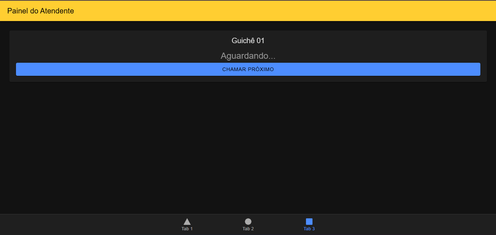

# MobileTicketsIonic 🏥

<<<<<<< HEAD
Sistema mobile para gestão de filas e tickets de atendimento laboratorial, desenvolvido com **Ionic Framework** e **Angular**. O projeto simula o fluxo completo desde a emissão da senha até a chamada no guichê, respeitando regras rigorosas de priorização.

## 📋 Requisitos do Projeto (Baseado no PDF)
O sistema foi construído para atender às seguintes especificações técnicas e de negócio:
- **Identificador de Senha:** Formato `YYMMDD-PPSQ` (Ex: 260402-SP01).
- **Categorias:** Prioritária (SP), Geral (SG) e Exames (SE).
- **Regra de Chamada:** Alternância entre Prioritária e demais tipos ($[SP] \to [SE|SG] \to [SP]$).
- **Horário de Expediente:** Emissão permitida apenas das 07:00 às 17:00.
- **Taxa de Desistência:** Simulação de 5% de não comparecimento (descarte de senha).

## 📸 Demonstração
Aqui estão as telas principais do sistema:

### 1. Totem de Autoatendimento (Tab 1)
Interface utilizada pelo cliente para selecionar o tipo de serviço e gerar o ticket.


### 2. Painel de Chamadas (Tab 2)
Exibição em tempo real da senha atual e histórico das últimas 5 chamadas, incluindo indicadores de desempenho (KPIs).


### 3. Console do Atendente (Tab 3)
Interface para os funcionários chamarem o próximo cliente seguindo a lógica de priorização automática.


## 🛠️ Tecnologias Utilizadas
- **Framework:** [Ionic v7+](https://ionicframework.com/)
- **Lógica:** [Angular v17+](https://angular.io/) (Standalone Components)
- **Linguagem:** TypeScript
- **Integração:** Capacitor (Pronto para Android/iOS)

## 🚀 Como Executar
1. Instale as dependências:
   ```bash
   npm install
=======
Aplicação mobile voltada para o gerenciamento de filas e distribuição de senhas em ambientes laboratoriais, desenvolvida utilizando Ionic Framework em conjunto com Angular. O sistema reproduz todo o ciclo de atendimento, desde a geração da senha até sua chamada no guichê, seguindo critérios bem definidos de prioridade.

## 📋 Requisitos do Projeto (Conforme especificação)

A solução foi projetada com base nas seguintes regras funcionais e técnicas:

Padrão de Identificação: Senhas no formato YYMMDD-PPSQ (exemplo: 260402-SP01).
Tipos de Atendimento: Prioritário (SP), Geral (SG) e Exames (SE).
Ordem de Atendimento: Alternância entre senhas prioritárias e demais categorias ($[SP] \rightarrow [SE|SG] \rightarrow [SP]$).
Período de Funcionamento: Emissão de senhas disponível apenas entre 07:00 e 17:00.
Simulação de Ausência: Considera uma taxa de 5% de desistência, descartando senhas não atendidas.

A seguir, as principais interfaces da aplicação:

1. Totem de Autoatendimento (Tab 1)

Tela onde o usuário seleciona o serviço desejado e gera sua senha de atendimento.

2. Painel de Chamadas (Tab 2)

Exibe, em tempo real, a senha atual em atendimento e o histórico das últimas cinco chamadas, além de métricas de desempenho (KPIs).

3. Console do Atendente (Tab 3)

Interface utilizada pelos atendentes para chamar os próximos clientes, respeitando automaticamente as regras de prioridade definidas.

## 🛠️ Tecnologias Utilizadas
Framework: Ionic (versão 7 ou superior)
Arquitetura/Lógica: Angular (versão 17+, com Standalone Components)
Linguagem: TypeScript
Plataforma Mobile: Capacitor (compatível com Android e iOS)

## 🚀 Como Executar
Instale as dependências do projeto:
   ```bash
   npm install
>>>>>>> fb4352a1e568dc8b01e92513b802d37719b2b312
